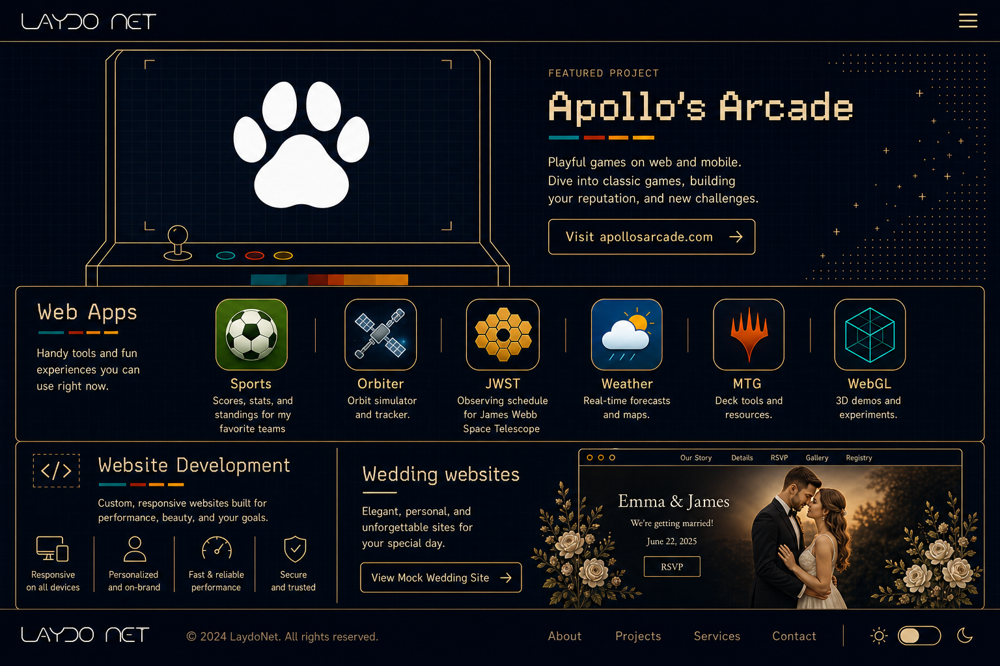
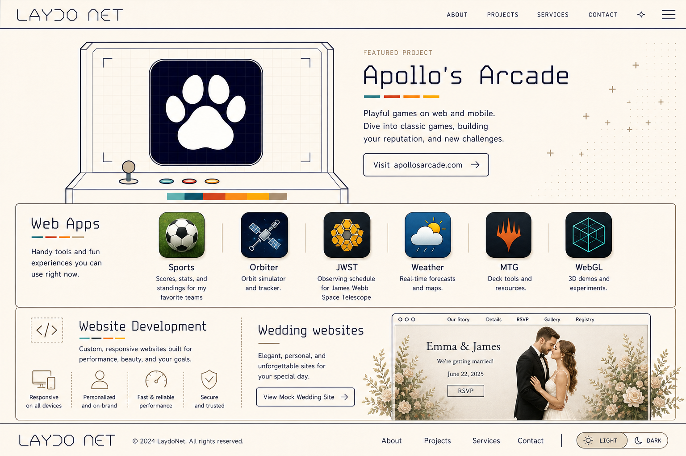

# Home Design Reference

This document captures the approved LaydoNet home page visual direction for future implementation work.

## Approved Designs

Dark theme:



Light theme:



## Design Direction

- Use the existing LaydoNet shell: fixed top nav, overlay menu behavior, theme toggle, and footer.
- Base the page language on the LaydoNet SVG wordmark: thin monoline strokes, geometric letterforms, open spacing, outlined UI, and restrained animation.
- Use Apollo's Arcade as the first content section and primary feature.
- Keep the page modern and arcade-inspired without leaning on handheld devices, phones, controllers, or console hardware.
- Preserve the same structure in dark and light themes so the theme toggle feels like a true palette swap rather than a separate layout.

## Theme Palette

Use the existing CSS variables from `src/styles/site.css`.

Light theme:

- Background: `#fff8ed`
- Secondary: `#c0aa92`
- Accent: `#80716c`
- Text and line work: `#000020`

Dark theme:

- Background: `#000020`
- Secondary: `#80716c`
- Accent: `#ffe2b8`
- Text and line work: `#fff8ed`

Use fine grid textures, subtle glass/backdrop treatment, and low-contrast section fills. Avoid broad gradients and one-note palettes.

## Navigation And Footer

- Keep the current SVG wordmark in the nav and footer:

```html
<svg viewBox="0 14 100 24" aria-hidden="true"><path d="M5 20 C 5 30 5 30 15 30 C20 17 20 17 25 30 M19 26 L21 26" stroke-width="1" fill="none"></path><path d="M25 20 Q 30 28 35 20 M30 24 L30 30" stroke-width="1" fill="none"></path><path d="M35 20 L40 20 C 45 20 45 30 40 30 L35 30" stroke-width="1" fill="none"></path><circle cx="50" cy="25" r="5" stroke-width="1" fill="none"></circle><path d="M65 30 L65 25 C65 18 75 18 75 25 L75 30 M85 30 L80 30 C75 30 75 20 80 20 L85 20 M80 25 L82 25 M86 20 L95 20 M90 20 L90 30" stroke-width="1" fill="none"></path></svg>
```

- Render the wordmark with `stroke: var(--font-color)`.
- Keep the hamburger menu and full-screen overlay menu.
- Footer should include the LaydoNet wordmark, copyright text, navigation links, and a visible theme toggle.

## Apollo's Arcade Section

- This is the lead section.
- Use the Apollo's Arcade paw icon from `/Users/laydo/apollos-arcade/apollos-arcade-icon.png` as the brand asset.
- Draw inspiration from `apollosarcade.com`: cream canvas in light theme, dark grid surface, thin arcade cabinet outlines, restrained accent bars, and pixel-grid texture.
- Keep the arcade screen clean: centered paw mark over a quiet grid with no Asteroids ships, bullets, score sprites, enemies, or extra game graphics.
- Keep the cabinet outline, screen frame, joystick, buttons, and accent bars.
- CTA destination: `https://www.apollosarcade.com`.

Copy:

```text
Playful games on web and mobile. Dive into classic games, building your reputation, and new challenges.
```

Do not include the previous "New games and experiments added regularly" sentence or icon row.

## Web Apps Section

- Keep the iOS/Android-style rounded-square app icon structure.
- Apps: Sports, Orbiter, JWST, Weather, MTG, WebGL.
- Icons should feel elevated and clickable, with subtle hover lift and restrained color accents.
- Keep descriptions short and scannable.

Required descriptions:

- Sports: `Scores, stats, and standings for my favorite teams`
- Orbiter: short description for the ISS/orbit tracking experience.
- JWST: `Observing schedule for James Webb Space Telescope`
- Weather: short description for forecasts and maps.
- MTG: short description for Magic deck/card tools.
- WebGL: short description for 3D demos and experiments.

## Website Development Section

- Preserve the approved direction from the concepts.
- Present services as custom, responsive website development with refined line icons.
- Wedding websites are the highlighted service and should lead into the wedding mock site.
- Use a polished preview of the wedding site, warm photo treatment, and a clear CTA.

Primary CTA:

```text
View Mock Wedding Site
```

Destination: `/wedding/`

## Interaction Notes

- App icons and feature panels should use hover/focus states with a small lift, outline brightening, or accent-bar movement.
- Keep motion subtle and CSS-friendly: line draw effects, opacity shifts, icon elevation, and grid shimmer are enough.
- Maintain keyboard accessibility for all clickable tiles and CTAs.
- Preserve existing theme toggle behavior and route handling from `src/lib/client/home.ts` and the shared shell.

## Implementation Constraints

- Keep the site static and Vite-based.
- Keep changes scoped to the home page HTML, home styles, and small home-page behavior as needed.
- Do not change the shared nav, overlay, footer, or theme behavior unless required to support the approved home design.
- Avoid nested cards.
- Keep cards at `8px` radius or less, except mobile-app-style icons.
- Keep `static/` assets tracked because Vite serves them from the public directory.
