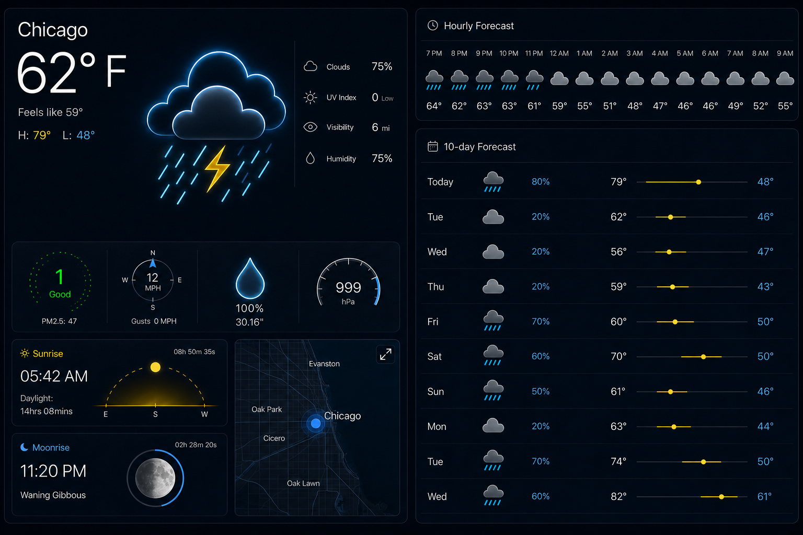
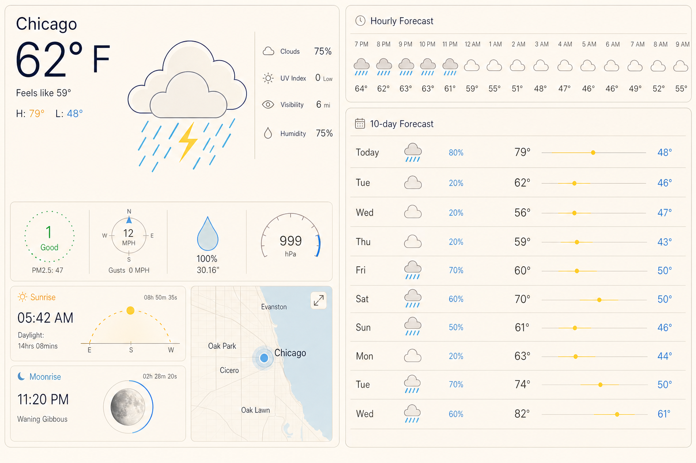

# Weather Design Reference

This document captures the approved Weather app visual direction for future implementation and QA work.

## Approved Designs

Dark theme:

Light theme:

## Layout

- Use a two-column desktop dashboard.
- Left column is dedicated to live current conditions, dynamic weather artwork, metric graphics, sun/moon panels, and the retained map.
- Right column is dedicated to forecast content: hourly forecast strip above the 10-day forecast list.
- Stack the dashboard before the left current-condition panel becomes compressed. Mid-width layouts should prefer a clean single-column stack over squeezed panels.
- Keep the Weather search and unit toggle compact and outside the visual focus of the dashboard.

## Current Conditions Panel

- Top-left content uses a large city label, large temperature, feels-like text, and high/low values.
- The main weather artwork sits centered in the top panel and should not crowd the temperature lockup.
- The main artwork may use a subtle glow, but the glow should feel like a tight outline/halo rather than a broad cyan bloom.
- The right-side current attributes list should include only non-redundant current metrics:
  - Clouds
  - UV Index
  - Visibility
  - Humidity
- Current attribute values should not wrap. Use non-breaking units where needed.

## Forecast Icons

- Forecast icons are separate from the large current-weather artwork.
- Use a minimal filled style, not hollow line art.
- Clouds should be a single filled cloud shape with gray fills in dark theme and warm light-gray fills in light theme.
- Cloud bottom edges should be mostly flat, with a rounded rise on the left into the cloud body.
- Rain and snow strokes should start below the cloud body rather than slicing through the cloud.
- Sun icons should have a filled yellow center with short, clean rays and enough contrast in both themes.

## Metric Graphics

- The four metric graphics are AQI, Wind, Precipitation, and Pressure.
- AQI uses a dotted circular ring and green status color.
- Wind uses a compact compass, with the directional marker constrained near the compass rim. The marker should not cross the speed value.
- Compass direction labels need breathing room outside the compass rim.
- Precipitation uses a standalone raindrop. The water fill level should represent precipitation probability.
- Pressure uses a wide half-circle gauge arc above the pressure value. The arc should not collide with the number.

## Sun, Moon, And Map

- Sun panel uses a clean horizon line, dashed arc, and yellow sun position marker.
- Moon panel uses a circular moon graphic with a blue accent ring.
- Keep the Leaflet map even though it is not in the original Laydo weather reference.
- Theme the map visually so it feels integrated with the dark and light Weather dashboard.

## Theme Notes

- Dark theme should use a deep navy/black dashboard background, fine blue-gray borders, cyan weather accents, yellow sun/range accents, and white/off-white text.
- Light theme should use the existing `.theme-light` palette from `src/styles/site.css`, with warm off-white panels, navy text, blue precipitation/low-temp accents, and yellow sun/range accents.
- Avoid one-note palettes. Both themes should preserve contrast between cyan, yellow, green, gray, and the base panel colors.

## Implementation Constraints

- Keep the app static and browser-only.
- Continue using Open-Meteo for weather/geocoding data.
- Do not add secret-bearing astronomy APIs.
- Use `suncalc` locally for moon phase and moonrise/moonset information.
- Keep styling Weather-specific where possible. Avoid broad changes to shared layout patterns used by other pages.
- Preserve the existing LaydoNet shell and theme toggle behavior.
